# Authentication System Documentation

## Overview

This application uses a **JWT-based authentication system** with **refresh tokens** for secure, scalable session management. It supports email/password authentication and OAuth (Google, GitHub).

---

## Architecture

### Token Strategy

**Two-Token System:**

- **Access Token** (15 minutes, HttpOnly cookie)
  - Used for API requests
  - Short-lived for security
  - Stored in `token` cookie
- **Refresh Token** (7-30 days, HttpOnly cookie + Database)
  - Used to obtain new access tokens
  - Long-lived for UX
  - Stored in database (hashed with SHA-256)
  - Stored in `refreshToken` cookie
  - **Token Rotation**: New refresh token issued on each use

### Security Features

1. **HttpOnly Cookies** - XSS protection (JavaScript cannot access)
2. **CSRF Protection** - Double Submit Cookie pattern
3. **Token Rotation** - Refresh tokens rotated on each use with family tracking
4. **Reuse Detection** - Detects stolen tokens, revokes entire token family
5. **Password Hashing** - bcrypt with salt (10 rounds)
6. **Rate Limiting** - 5 login attempts per 15 minutes
7. **OAuth Security** - State parameter with timestamp validation
8. **IP & User-Agent Tracking** - Detect suspicious activity
9. **Token Cleanup** - Daily cron job removes expired tokens
10. **Atomic Operations** - Database transactions prevent race conditions

---

## Authentication Flow Diagrams

### 1. Registration Flow


### 2. Login Flow


### 3. Token Refresh Flow (with Rotation & Reuse Detection)

```mermaid
sequenceDiagram
    participant Client
    participant API
    participant DB

    Client->>API: POST /api/auth/refresh
    Note over Client: Sends refreshToken cookie

    API->>API: Extract & hash refresh token
    API->>DB: BEGIN TRANSACTION

    API->>DB: Find refresh token record (FOR UPDATE)

    alt Token not found
        DB-->>API: NULL
        API->>DB: ROLLBACK
        API-->>Client: 401 Invalid token
    else Token found
        DB-->>API: Token record

        alt Token expired
            API->>DB: ROLLBACK
            API-->>Client: 401 Token expired
        else Token already revoked (revokedAt != null)
            Note over API: 🚨 REUSE DETECTED - Security breach!
            API->>DB: Find all tokens in family
            API->>DB: Revoke entire token family
            API->>DB: COMMIT
            API->>API: Clear cookies
            API-->>Client: 401 Token reused (security breach)
        else Token valid
            API->>API: Generate new access token (15min)
            API->>API: Generate new refresh token
            API->>API: Hash new refresh token

            API->>DB: Create new refresh token record
            Note over DB: Same familyId, new token

            API->>DB: Mark old token as revoked
            API->>DB: Link: old.replacedByTokenId = new.id

            API->>DB: COMMIT

            API->>API: Set new cookies (token, refreshToken)
            API-->>Client: 200 OK
            Note over Client: Client now has fresh tokens
        end
    end
```



### 4. OAuth Flow (Google/GitHub)


### 5. Password Reset Flow

```mermaid
sequenceDiagram
    participant Client
    participant API
    participant DB
    participant Email

    Note over Client,Email: Step 1: Request Reset
    Client->>API: POST /api/auth/forgot-password
    Note over Client: { email }

    API->>DB: Find user by email

    alt User not found
        Note over API: Return success anyway (security: don't reveal if email exists)
        API-->>Client: 200 OK
    else User found
        DB-->>API: User record

        API->>API: Generate reset token (32 random bytes)
        API->>API: Hash token (SHA-256)
        API->>DB: Store hashed token + expiry (1 hour)

        API->>Email: Send reset email with plain token
        Note over Email: Link: /reset-password?token=abc123

        API-->>Client: 200 OK
    end

    Note over Client,Email: Step 2: Reset Password
    Client->>API: POST /api/auth/reset-password
    Note over Client: { token, newPassword }

    API->>API: Hash provided token
    API->>DB: Find user with matching token hash

    alt Token not found or expired
        DB-->>API: NULL
        API-->>Client: 401 Invalid or expired token
    else Token valid
        DB-->>API: User record

        API->>API: Hash new password (bcrypt, 10 rounds)
        API->>DB: Update user.passwordHash
        API->>DB: Clear reset token fields

        Note over API: 🔒 Security: Force logout all devices
        API->>DB: Revoke ALL refresh tokens for user

        API->>Email: Send confirmation email
        API-->>Client: 200 OK

        Note over Client: User must log in again
    end
```



### 6. Multi-Device Session Management


### 7. Token Reuse Detection (Security Scenario)

```mermaid
sequenceDiagram
    participant Attacker
    participant LegitUser
    participant API
    participant DB

    Note over Attacker,DB: Scenario: Attacker steals old refresh token

    LegitUser->>API: POST /api/auth/refresh
    Note over LegitUser: Token V1 (familyId: X)

    API->>DB: BEGIN TRANSACTION
    API->>DB: Rotate token V1 → V2
    Note over DB: V1.revokedAt = now<br/>V1.replacedByTokenId = V2.id<br/>V2 created in family X
    API->>DB: COMMIT
    API-->>LegitUser: New token V2

    Note over Attacker: 🚨 Attacker tries to use OLD token V1
    Attacker->>API: POST /api/auth/refresh
    Note over Attacker: Token V1 (already revoked)

    API->>DB: Find token V1
    DB-->>API: Token record (revokedAt != null)

    Note over API: ⚠️ REUSE DETECTED!
    API->>DB: Find familyId X
    API->>DB: Revoke ALL tokens in family X
    Note over DB: Token V2 also revoked

    API-->>Attacker: 401 Token reused (clears cookies)

    Note over LegitUser: Next request fails
    LegitUser->>API: POST /api/auth/refresh
    Note over LegitUser: Token V2 (now revoked)
    API-->>LegitUser: 401 Token revoked

    Note over LegitUser: User forced to log in again (secure!)
```



---

## Database Schema

### User Model

```prisma
model User {
  id           String          @id @default(cuid())
  email        String          @unique
  passwordHash String?         // bcrypt hash, null for OAuth users
  name         String?
  provider     AuthProvider    @default(EMAIL)  // EMAIL, GOOGLE, GITHUB
  providerId   String?         @unique          // OAuth provider ID
  avatar       String?         // Profile picture URL
  plan         Plan            @default(FREE)
  credits      Int             @default(3)

  refreshTokens RefreshToken[] // All active sessions

  resetPasswordToken   String?   // Hashed password reset token
  resetPasswordExpires DateTime?

  termsAcceptedAt   DateTime?
  termsAcceptedIp   String?

  createdAt    DateTime        @default(now())
  updatedAt    DateTime        @updatedAt
}
```

### RefreshToken Model

```prisma
model RefreshToken {
  id        String   @id @default(cuid())
  token     String   @unique      // Hashed with SHA-256
  userId    String
  user      User     @relation(fields: [userId], references: [id], onDelete: Cascade)

  // Token family for rotation tracking
  familyId  String   @default(cuid())

  expiresAt DateTime
  createdAt DateTime @default(now())

  // Security tracking
  lastUsedAt DateTime?
  revokedAt  DateTime?  // When token was rotated or revoked
  ipAddress  String?
  userAgent  String?    // Browser/device info

  // Token rotation chain
  replacedByTokenId String? @unique
  replacedByToken   RefreshToken? @relation("TokenReplacement", fields: [replacedByTokenId], references: [id])
  replacesToken     RefreshToken? @relation("TokenReplacement")

  @@index([userId])
  @@index([familyId])
  @@index([revokedAt])
}
```

---

## API Endpoints

### Authentication

#### POST `/api/auth/register`

**Rate Limit:** 5 requests / 15 minutes

**Request:**

```json
{
  "email": "user@example.com",
  "password": "password123",
  "name": "John Doe",
  "agreedToTerms": true
}
```

**Response:**

```json
{
  "user": {
    "id": "...",
    "email": "user@example.com",
    "name": "John Doe",
    "credits": 3,
    "avatar": null
  }
}
```

**Cookies Set:**

- `token` (access token, 15min)
- `refreshToken` (refresh token, 7 days)
- `csrf-token` (CSRF protection, 24 hours)

---

#### POST `/api/auth/login`

**Rate Limit:** 5 requests / 15 minutes

**Request:**

```json
{
  "email": "user@example.com",
  "password": "password123",
  "rememberMe": false
}
```

**Response:** Same as register

**Cookies Set:** Same as register (refresh token expires in 30 days if `rememberMe: true`)

---

#### POST `/api/auth/logout`

**Auth Required:** Yes

**Actions:**

1. Deletes refresh token from database
2. Clears `token` and `refreshToken` cookies

---

#### POST `/api/auth/refresh`

**Auth Required:** No (uses refresh token cookie)

**Flow (Atomic Transaction):**

1. Reads `refreshToken` from cookie
2. Hashes token and looks up in database
3. **Validates token:**
   - Token must exist (NOT_FOUND)
   - Token must not be expired (EXPIRED)
   - Token must not be revoked (REUSED - security breach!)
4. **Reuse Detection:** If token was already used (revoked), revokes entire token family
5. **Rotation:** Creates new token in same family, revokes old token, links them
6. Generates new access token
7. Sets both new tokens as cookies

**Response:**

```json
{
  "message": "Token refreshed successfully"
}
```

**Error Cases:**

- `401` - Token not found, expired, or reused (clears cookies if reused)
- `500` - Internal server error

---

#### GET `/api/auth/current-user`

**Auth Required:** Yes

**Response:**

```json
{
  "id": "...",
  "name": "John Doe",
  "email": "user@example.com",
  "avatar": "https://...",
  "credits": 3
}
```

---

#### GET `/api/auth/sessions`

**Auth Required:** Yes

**Response:**

```json
{
  "sessions": [
    {
      "id": "...",
      "createdAt": "2025-12-01T10:00:00Z",
      "lastUsedAt": "2025-12-08T14:30:00Z",
      "ipAddress": "192.168.1.1",
      "userAgent": "Mozilla/5.0 (Windows NT 10.0; Win64; x64) Chrome/120.0.0.0"
    }
  ]
}
```

**Use Case:** Show user all active sessions (devices/browsers)

---

#### DELETE `/api/auth/sessions/:id`

**Auth Required:** Yes

**Use Case:** Revoke specific session (logout from one device)

---

### Password Reset

#### POST `/api/auth/forgot-password`

**Rate Limit:** 3 requests / 15 minutes

**Request:**

```json
{
  "email": "user@example.com"
}
```

**Actions:**

1. Generates secure reset token (32 random bytes)
2. Hashes token with SHA-256
3. Stores hashed token in database (expires in 1 hour)
4. Sends email with plain token

---

#### POST `/api/auth/reset-password`

**Rate Limit:** 3 requests / 15 minutes

**Request:**

```json
{
  "token": "abc123...",
  "newPassword": "newpassword123"
}
```

**Actions:**

1. Verifies token exists and not expired
2. Updates password (bcrypt hash)
3. **Revokes ALL refresh tokens** (security: force re-login on all devices)

---

### OAuth

#### GET `/api/auth/google`

**Query Params:** `redirectUrl` (optional, default: `/`)

**Flow:**

1. Creates state parameter with `redirectUrl` and timestamp
2. Redirects to Google OAuth consent screen

---

#### GET `/api/auth/google/callback`

**Handled by Passport.js**

**Flow:**

1. Google redirects here after user authorizes
2. Verifies state parameter (CSRF protection, max 10 minutes old)
3. Creates or links user account
4. Syncs avatar from Google
5. Generates access + refresh tokens
6. Redirects to frontend with cookies set

**Account Linking:**

- Uses composite unique key: `provider` + `providerId`
- **Google:** Requires verified email for all operations
- **GitHub:** Requires verified email only when linking to existing account
- If email already exists and verified: Links OAuth to existing account
- If new email: Creates new user with OAuth provider (even if unverified)

---

#### GET `/api/auth/github`

Same as Google OAuth, different provider

#### GET `/api/auth/github/callback`

Same flow as Google callback

---

## Security Features Explained

### 1. CSRF Protection

**Pattern:** Double Submit Cookie

**How it works:**

1. Server generates random token (32 bytes)
2. Sets as **non-HttpOnly** cookie `csrf-token` (JavaScript can read)
3. Frontend reads cookie and sends in `X-CSRF-Token` header
4. Server validates cookie matches header

**When validated:**

- All POST/PUT/DELETE/PATCH requests
- Skipped for GET/HEAD/OPTIONS (safe methods)
- Skipped for webhooks (use signature verification)

---

### 2. Token Rotation & Reuse Detection

**Why:** Detect and respond to stolen refresh tokens

**How it works:**

1. Each refresh token belongs to a **token family** (same login session)
2. User requests new access token via `/refresh`
3. Server verifies token in **atomic database transaction:**
   - Checks if token exists and not expired
   - **Checks if token already revoked** (revokedAt field)
4. If token already used (revoked):
   - **SECURITY BREACH DETECTED!**
   - Revokes **entire token family** (all tokens from that login)
   - Forces re-login on all devices from that session
5. If token valid:
   - Creates new token in **same family**
   - Revokes old token (sets `revokedAt`, links to new token)
   - Returns new access + refresh tokens

**Security benefits:**

- **Reuse Detection:** If attacker uses stolen token, system immediately detects it when real user tries to refresh
- **Family Revocation:** All tokens from compromised session are invalidated
- **Audit Trail:** `replacedByTokenId` creates chain showing token rotation history
- **Race Condition Prevention:** Database transaction ensures atomic operations

**Token Families Explained:**

All tokens created from the same login share a `familyId`. This allows the system to:

- Track all tokens from a single authentication session
- Revoke all related tokens if any one is compromised
- Maintain separate sessions across multiple devices

---

### 3. Rate Limiting

**Endpoints protected:**

- `/auth/register`, `/auth/login`: 5 attempts / 15 minutes
- `/auth/forgot-password`, `/auth/reset-password`: 3 attempts / 15 minutes

**Tracked by:** IP address

---

### 4. OAuth Security

**Composite Unique Constraint:**

- Schema uses `@@unique([provider, providerId])` instead of `@unique` on `providerId` alone
- Prevents conflicts when different OAuth providers assign the same ID
- Queries use composite key: `where: { provider_providerId: { provider: 'GOOGLE', providerId: googleId }}`

**Email Verification Protection:**

- **Google OAuth:** Requires verified email for all operations (strict)

  - Google emails are always verified, safe to enforce
  - Blocks any OAuth attempt with unverified email

- **GitHub OAuth:** Lenient approach (better UX)
  - Allows new account creation even if email unverified
  - **Only blocks account linking** if email unverified
  - Prevents attack: Attacker with unverified `victim@example.com` cannot hijack victim's existing account

**State Parameter Protection:**

- Stores `redirectUrl` and timestamp in base64-encoded state
- Validates state on callback (CSRF protection)
- State expires after 10 minutes

---

### 5. Token Cleanup Job

**File:** `src/jobs/cleanupExpiredTokens.ts`

**Schedule:** Daily at 3 AM

**Actions:**

1. Deletes expired password reset tokens
2. Deletes expired refresh tokens
3. Deletes old revoked refresh tokens (keep for audit trail, but cleanup after time)

**Why:** Prevent database bloat, maintain performance, cleanup rotation history

---

## Frontend Integration

### Auto-Refresh Flow

```typescript
// In AuthProvider.tsx
useEffect(() => {
  const initAuth = async () => {
    setIsLoading(true)
    try {
      const currentUser = await authService.ensureSession()
      setUser(currentUser)
    } catch (error) {
      console.error('Unexpected error in initAuth:', error)
      setUser(null)
    } finally {
      setIsLoading(false)
    }
  }

  void initAuth()
}, [])
```

### Refresh single-flight lock (prevents parallel refresh storms)

```typescript
let refreshInFlight: Promise<boolean> | null = null

export async function refreshAccessToken(): Promise<boolean> {
  if (refreshInFlight) return refreshInFlight

  refreshInFlight = (async () => {
    try {
      await api.post('/auth/refresh')
      return true
    } catch {
      return false
    } finally {
      refreshInFlight = null
    }
  })()

  return refreshInFlight
}
```

---

## Production Checklist

### Before Deployment

- [x] Access tokens expire in 15 minutes
- [x] Refresh tokens expire in 7-30 days
- [x] Rate limiting set to 5 attempts
- [x] CSRF protection enabled
- [x] Token rotation enabled
- [x] HttpOnly cookies enabled
- [x] Secure flag enabled in production (`IS_PRODUCTION=true`)
- [x] Token cleanup cron job running
- [x] Password reset revokes all tokens
- [x] OAuth state parameter expires in 10 minutes
- [x] JWT_SECRET is 32+ characters (check .env)
- [x] All OAuth credentials set (Google, GitHub)
- [x] HTTPS enabled (required for secure cookies)
- [x] CORS configured for production domain

### Environment Variables Required

```env
# JWT
JWT_SECRET=<32+ character random string>

# OAuth
GOOGLE_CLIENT_ID=...
GOOGLE_CLIENT_SECRET=...
GOOGLE_REDIRECT_URI=https://yourdomain.com/api/auth/google/callback

GITHUB_CLIENT_ID=...
GITHUB_CLIENT_SECRET=...
GITHUB_REDIRECT_URI=https://yourdomain.com/api/auth/github/callback

# Email
RESEND_API_KEY=...

# Frontend
FRONTEND_URL=https://yourdomain.com

# Database
DATABASE_URL=postgresql://...

# Environment
NODE_ENV=production
```

---

## Future Enhancements

### Planned Features

- [ ] Email verification on registration
- [ ] 2FA (Two-Factor Authentication)
- [ ] Suspicious activity email alerts
- [ ] Session management UI (view/revoke devices)
- [ ] Remember device (skip 2FA for trusted devices)
- [ ] Account deletion with token revocation

### Optional Improvements

- [x] Token reuse detection (detect stolen tokens) ✅
- [x] Token family tracking for session management ✅
- [ ] Geolocation tracking for sessions
- [ ] Login history log
- [ ] Security audit log
- [ ] Automatic suspicious activity alerts

---

## File Structure

```
server/src/
├── routes/
│   └── auth.routes.ts         # All auth endpoints
├── middleware/
│   ├── auth.ts                # JWT verification
│   ├── csrf.ts                # CSRF protection
│   └── rateLimiter.ts         # Rate limiting
├── utils/
│   ├── refreshToken.ts        # Token generation/validation/rotation
│   ├── setAuthCookie.ts       # Cookie helpers
│   ├── getUserId.ts           # Extract userId from JWT
│   └── createPasswordResetToken.ts
├── config/
│   ├── passport.ts            # OAuth strategies
│   └── env.ts                 # Environment variables
├── services/
│   └── emailService.ts        # Email sending (Resend)
├── jobs/
│   ├── cleanupExpiredTokens.ts
│   └── index.ts               # Job scheduler
└── constants/
    └── tokenExpiry.ts         # Token duration configs
```

---

## Support

For questions or issues with the authentication system:

1. Check this documentation first
2. Review code comments in `src/routes/auth.routes.ts`
3. Test with Postman collection
4. Check server logs for detailed error messages

**Last Updated:** December 16, 2025
