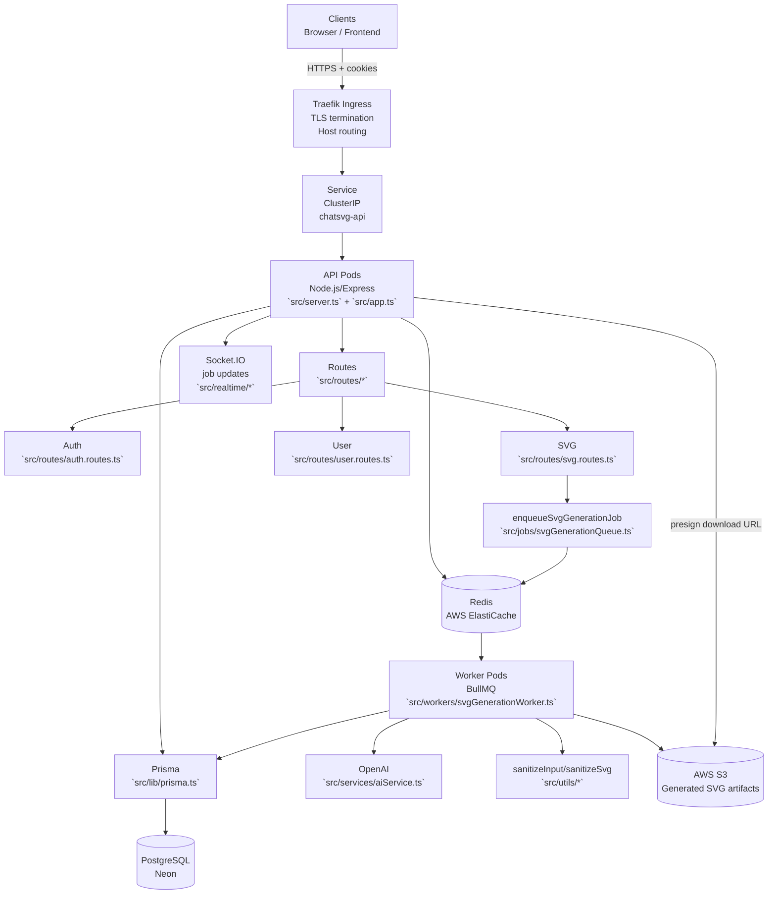
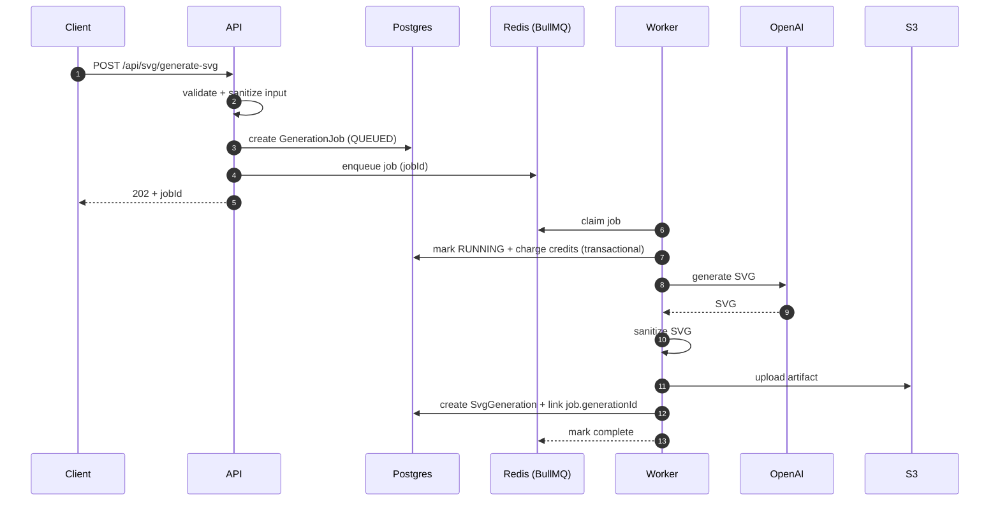
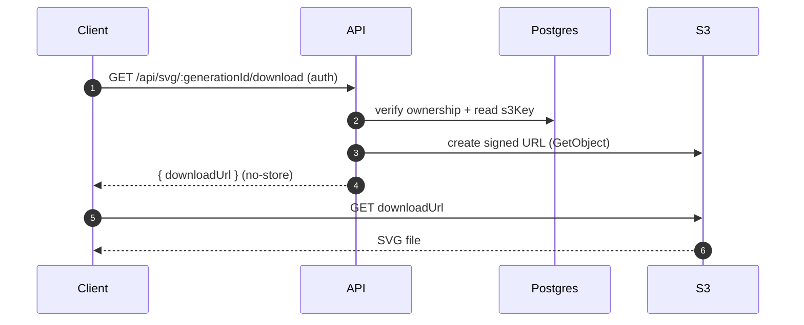

# Backend Architecture

This document describes the **backend (this repo)** architecture and runtime flows for ChatSVG.

- **Production API:** https://api.chatsvg.dev
- **Frontend:** https://chatsvg.dev
- **Infrastructure:** `INFRA.md`
- **System diagram:** `SYSTEM_ARCHITECTURE.md`

---

## Runtime overview

---

## HTTP entry points

- `src/server.ts`: boots the HTTP server and Socket.IO.
- `src/app.ts`: Express app setup (middleware, routing, error handling).

---

## Authentication & session model

Auth is cookie-based.

- Access token: short-lived JWT (`token` cookie)
- Refresh token: long-lived, stored hashed in the DB (`refreshToken` cookie)
- Rotation + reuse detection: reusing an old refresh token revokes the full token family
- CSRF protection: double-submit cookie pattern for state-changing requests

For detailed flows: `AUTHENTICATION.md`.

---

## Async SVG generation (API → queue → worker)

SVG generation is asynchronous so API requests stay fast even with long OpenAI latencies.

Notes:

- Jobs are created with an idempotency key (optional) to safely retry requests.
- Worker failures refund credits on permanent failure.

For deeper details: `ASYNC_GENERATION.md`.

---

## Download flow (signed URLs)

Generated files are stored in S3. The API returns short-lived signed URLs for downloads.

---

## Data & services

- PostgreSQL (Neon): users, sessions, job metadata, generation metadata
- Redis (ElastiCache): BullMQ queues and coordination
- S3: generated SVG artifacts + signed download URLs

---

## CI/CD (high level)

- GitHub Actions builds Docker images and pushes to ECR.
- A self-hosted runner on the EC2 instance updates k3s deployments via `kubectl set image`.

See: `INFRA.md`.
