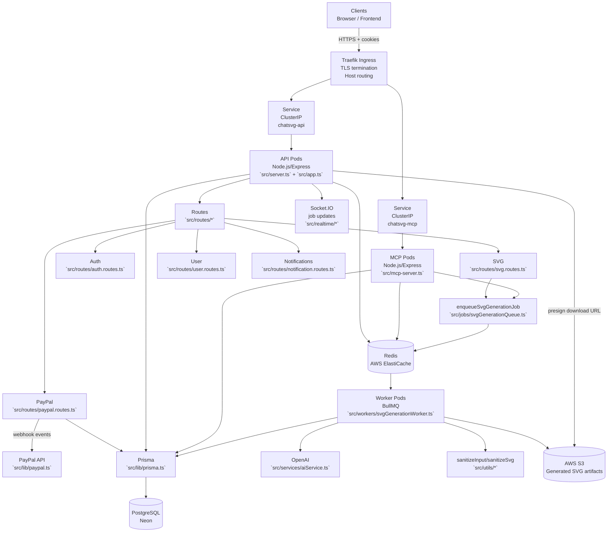
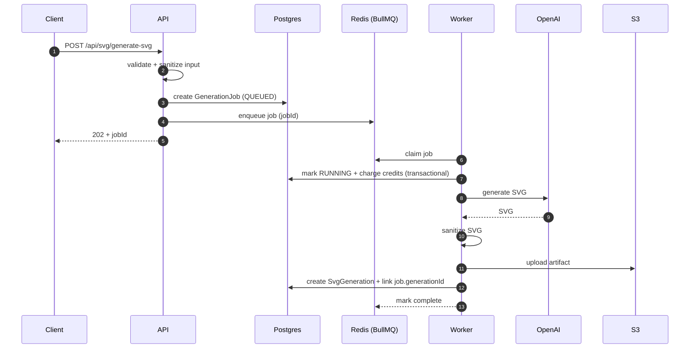
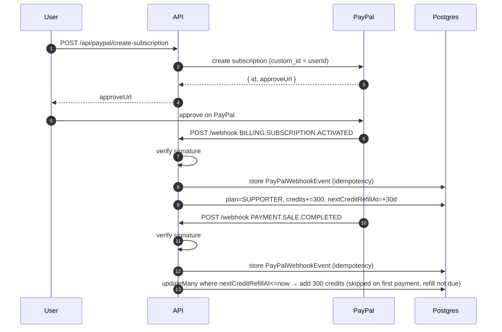
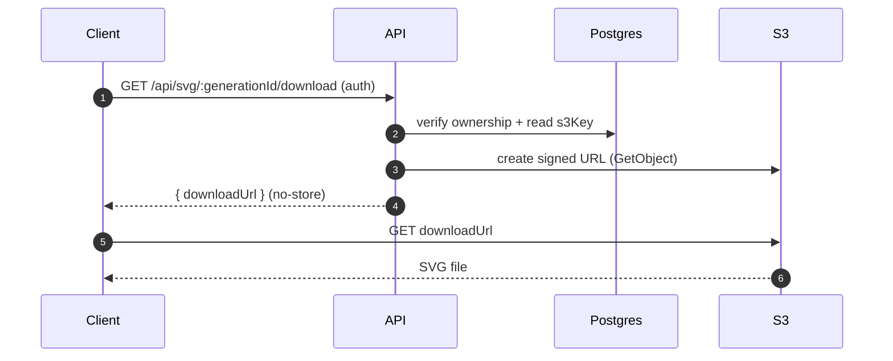

# Backend Architecture

This document describes the **backend (this repo)** architecture and runtime flows for ChatSVG.

- **Production API:** https://api.chatsvg.dev
- **Frontend:** https://chatsvg.dev
- **Infrastructure:** `INFRA.md`
- **System diagram:** `SYSTEM_ARCHITECTURE.md`

---

## Runtime overview

```mermaid
flowchart TB
  Client[Clients\nBrowser / Frontend] -->|HTTPS + cookies| Ingress[Traefik Ingress\nTLS termination\nHost routing]
  Ingress --> ApiSvc[Service\nClusterIP\nchatsvg-api]
  Ingress --> McpSvc[Service\nClusterIP\nchatsvg-mcp]
  ApiSvc --> API[API Pods\nNode.js/Express\n`src/server.ts` + `src/app.ts`]
  McpSvc --> MCP[MCP Pods\nNode.js/Express\n`src/mcp-server.ts`]

  API --> Routes[Routes\n`src/routes/*`]
  Routes --> Auth[Auth\n`src/routes/auth.routes.ts`]
  Routes --> Svg[SVG\n`src/routes/svg.routes.ts`]
  Routes --> User[User\n`src/routes/user.routes.ts`]
  Routes --> Notif[Notifications\n`src/routes/notification.routes.ts`]
  Routes --> PayPal[PayPal\n`src/routes/paypal.routes.ts`]

  PayPal -->|webhook events| PayPalAPI[PayPal API\n`src/lib/paypal.ts`]
  PayPal --> Prisma

  API --> Prisma[Prisma\n`src/lib/prisma.ts`]
  Prisma --> Postgres[(PostgreSQL\nNeon)]

  API --> Redis[(Redis\nAWS ElastiCache)]
  MCP --> Redis
  MCP --> Prisma

  Svg --> Queue[enqueueSvgGenerationJob\n`src/jobs/svgGenerationQueue.ts`]
  Queue --> Redis

  Redis --> Worker[Worker Pods\nBullMQ\n`src/workers/svgGenerationWorker.ts`]
  Worker --> OpenAI[OpenAI\n`src/services/aiService.ts`]
  Worker --> Sanitize[sanitizeInput/sanitizeSvg\n`src/utils/*`]
  Worker --> Prisma
  Worker --> S3[(AWS S3\nGenerated SVG artifacts)]
  MCP --> Queue

  API -->|presign download URL| S3
  API --> Realtime[Socket.IO\njob updates\n`src/realtime/*`]
```

---

## HTTP entry points

- `src/server.ts`: boots the HTTP server and Socket.IO.
- `src/app.ts`: Express app setup (middleware, routing, error handling).
- `src/mcp-server.ts`: standalone MCP Streamable HTTP server (`/mcp`).

---

## Authentication & session model

Auth is cookie-based.

- Access token: short-lived JWT (`token` cookie)
- Refresh token: long-lived, stored hashed in the DB (`refreshToken` cookie)
- Rotation + reuse detection: reusing an old refresh token revokes the full token family
- CSRF protection: double-submit cookie pattern for state-changing requests

For detailed flows: `AUTHENTICATION.md`.

MCP authentication is OAuth Bearer-token based and handled by `oauthAuth` middleware.

---

## MCP server (OAuth + Streamable HTTP)

The MCP process is separate from the REST API process.

- Transport endpoints: `POST /mcp`, `GET /mcp`, `DELETE /mcp`, `GET /mcp/health`
- OAuth endpoints for MCP clients are exposed by the API app:
  - `GET /.well-known/oauth-authorization-server`
  - `POST /oauth/register`
  - `GET/POST /oauth/authorize`
  - `POST /oauth/token`
- Registered tools: `list_styles`, `generate_svg`, `get_job_status`

`generate_svg` reuses the same async queue + worker pipeline as `/api/svg` requests.

Session transports are tracked in-memory per MCP pod by `MCP-Session-Id`.

For full details: `MCP_SERVER.md`.

---

## Async SVG generation (API → queue → worker)

SVG generation is asynchronous so API requests stay fast even with long OpenAI latencies.

```mermaid
sequenceDiagram
  autonumber
  participant C as Client
  participant API as API
  participant DB as Postgres
  participant R as Redis (BullMQ)
  participant W as Worker
  participant O as OpenAI
  participant S3 as S3

  C->>API: POST /api/svg/generate-svg
  API->>API: validate + sanitize input
  API->>DB: create GenerationJob (QUEUED)
  API->>R: enqueue job (jobId)
  API-->>C: 202 + jobId

  W->>R: claim job
  W->>DB: mark RUNNING + charge credits (transactional)
  W->>O: generate SVG
  O-->>W: SVG
  W->>W: sanitize SVG
  W->>S3: upload artifact
  W->>DB: create SvgGeneration + link job.generationId
  W-->>R: mark complete
```

Notes:

- Jobs are created with an idempotency key (optional) to safely retry requests.
- Worker failures refund credits on permanent failure.

---

## Notifications

Notifications are stored in PostgreSQL (Prisma `Notification` model) and used for the notifications bell UX.

### API endpoints

Routes are mounted at `/api/notification` in `src/app.ts`:

- `GET /api/notification/latest` – cursor pagination for the latest notifications
- `GET /api/notification/badge` – count of notifications created after `User.notificationsLastSeenAt`
- `POST /api/notification/seen` – updates `User.notificationsLastSeenAt` to "now"

CSRF validation is enforced only for state-changing requests (so `POST /seen` requires `X-CSRF-Token`, GETs do not).

### Creation triggers

Notifications are created server-side (best-effort) at these points:

- Welcome notification on successful registration (`src/routes/auth.routes.ts`)
- Job succeeded / failed notifications from the worker (`src/workers/svgGenerationWorker.ts`)
- "Out of credits" notification after a successful job if the user reaches 0 credits

For deeper details: `ASYNC_GENERATION.md`.

---

## PayPal billing (webhook-driven)

Plan upgrades and downgrades are driven entirely by PayPal webhook events — the app never polls PayPal.

```mermaid
sequenceDiagram
  autonumber
  participant U as User
  participant API as API
  participant PP as PayPal
  participant DB as Postgres

  U->>API: POST /api/paypal/create-subscription
  API->>PP: create subscription (custom_id = userId)
  PP-->>API: { id, approveUrl }
  API-->>U: approveUrl

  U->>PP: approve on PayPal
  PP->>API: POST /webhook BILLING.SUBSCRIPTION.ACTIVATED
  API->>API: verify signature
  API->>DB: store PayPalWebhookEvent (idempotency)
  API->>DB: plan=SUPPORTER, credits+=300, nextCreditRefillAt=+30d

  PP->>API: POST /webhook PAYMENT.SALE.COMPLETED
  API->>API: verify signature
  API->>DB: store PayPalWebhookEvent (idempotency)
  API->>DB: updateMany where nextCreditRefillAt<=now → add 300 credits (skipped on first payment, refill not due)
```

On cancellation/suspension/expiry: `BILLING.SUBSCRIPTION.CANCELLED/SUSPENDED/EXPIRED` → plan = FREE, refill = 0.

For full details: `PAYMENTS.md`.

---

## Download flow (signed URLs)

Generated files are stored in S3. The API returns short-lived signed URLs for downloads.

```mermaid
sequenceDiagram
  autonumber
  participant C as Client
  participant API as API
  participant DB as Postgres
  participant S3 as S3

  C->>API: GET /api/svg/:generationId/download (auth)
  API->>DB: verify ownership + read s3Key
  API->>S3: create signed URL (GetObject)
  API-->>C: { downloadUrl } (no-store)
  C->>S3: GET downloadUrl
  S3-->>C: SVG file
```

---

## Data & services

- PostgreSQL (Neon): users, sessions, job metadata, generation metadata
- Redis (ElastiCache): BullMQ queues and coordination
- S3: generated SVG artifacts + signed download URLs

---

## CI/CD (high level)

- GitHub Actions builds Docker images and pushes to ECR.
- A self-hosted runner on the EC2 instance updates k3s deployments for API + worker + MCP via `kubectl set image`.

See: `INFRA.md`.
